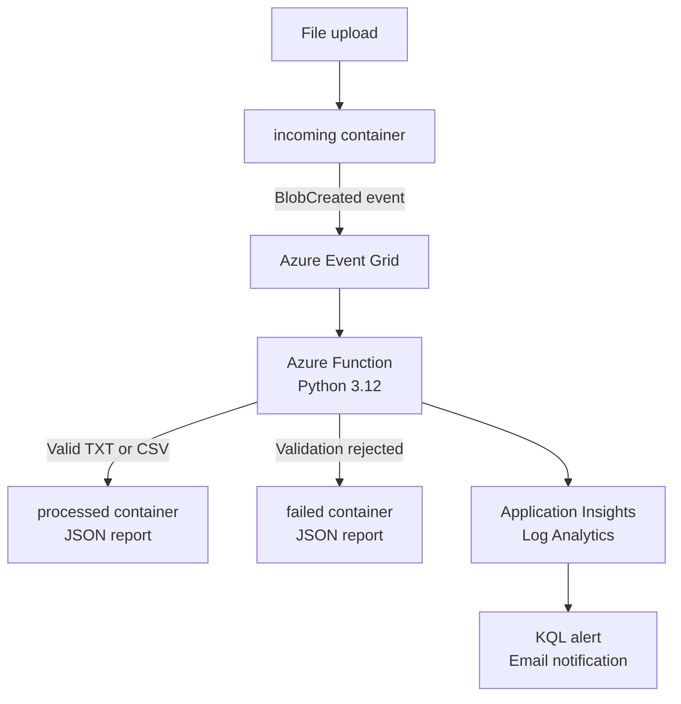

# CloudOps Serverless File Processor

[](https://github.com/Abdulsattar-Homsi/cloudops-serverless-file-processor/actions/workflows/deploy-function.yml)


An event-driven, serverless file-processing platform built on Microsoft Azure. Files uploaded to Blob Storage are validated and processed automatically, with structured JSON reports routed to success or failure containers.

The project demonstrates serverless architecture, Event Grid integration, passwordless Azure authentication, automated deployment with GitHub Actions and OIDC, unit testing, observability, alerting, and cost controls.

## Architecture



See [Architecture](docs/architecture.md) for the processing, security, CI/CD, and monitoring diagrams.

## Processing behavior

| Input | Validation and processing | Output |
|---|---|---|
| UTF-8 `.txt` | Counts lines, words, and characters | `processed/<name>.txt.json` |
| UTF-8 `.csv` | Validates consistent columns and reports rows, columns, and headers | `processed/<name>.csv.json` |
| Unsupported extension | Returns `UNSUPPORTED_FILE_TYPE` | `failed/<name>.json` |
| Invalid UTF-8 | Returns `INVALID_ENCODING` | `failed/<name>.json` |
| File over 10 MiB | Returns `FILE_TOO_LARGE` | `failed/<name>.json` |
| Inconsistent CSV rows | Returns `INVALID_CSV_STRUCTURE` | `failed/<name>.json` |

Every successful report also includes the source blob, file type, byte size, SHA-256 digest, status, and UTC processing timestamp.

Deterministic output paths make processing idempotent: if the same event is delivered more than once, the existing report is updated instead of creating unlimited duplicates.

## Azure services

| Service | Purpose |
|---|---|
| Azure Functions Flex Consumption | Serverless Python processing and automatic scaling |
| Azure Blob Storage | Incoming files, processed reports, failed reports, and deployment packages |
| Azure Event Grid | Low-latency `BlobCreated` event delivery |
| Managed Identities | Passwordless runtime and deployment access |
| Azure RBAC | Least-scope authorization for users and workloads |
| Application Insights | Function telemetry and structured traces |
| Log Analytics | KQL queries and centralized log storage |
| Azure Monitor | Log-search alert and email notification |
| Cost Management | Monthly budget and cost notifications |
| GitHub Actions | Automated testing and deployment |

## Security design

- Storage Shared Key authorization is disabled.
- The Function runtime uses a system-assigned managed identity.
- Blob trigger, Blob outputs, host storage, and deployment storage use identity-based connections.
- Application Insights ingestion uses Microsoft Entra authentication.
- GitHub Actions authenticates through OIDC and a federated credential.
- The deployment identity has `Website Contributor` only at Function App scope.
- HTTPS is enforced with TLS 1.2 or later.
- Anonymous Blob access is disabled.
- `local.settings.json` and local virtual environments are excluded from Git.
- No client secret, publish profile, Storage key, or connection-string secret is stored in the repository.

## CI/CD

Every push to `main` starts the GitHub Actions workflow:

1. Check out the repository.
2. Configure Python 3.12.
3. Install test dependencies.
4. compile-check the Python modules.
5. Run the seven unit tests.
6. Obtain a short-lived Azure token through GitHub OIDC.
7. Remotely build and deploy the package to Azure Functions.

OIDC is the authentication mechanism used by the pipeline; CI/CD is the complete automation process that tests and deploys the application.

## Observability

The Function writes traces for processing start, successful completion, and validation rejection. A KQL-based Azure Monitor alert detects rejected files:

```kusto
traces
| where message startswith "CloudOps validation failed"
| project timestamp, severityLevel, message, operation_Id
| order by timestamp desc
```

The alert was tested end-to-end by uploading an unsupported file. Azure Monitor entered the `Fired` state and delivered an email through an Action Group.

## Local development

Prerequisites:

- Python 3.12
- Azure Functions Core Tools 4
- Azurite

Create and activate a virtual environment on Windows:

```powershell
py -3.12 -m venv .venv
.\.venv\Scripts\Activate.ps1
python -m pip install --upgrade pip
pip install -r requirements-dev.txt
```

Use Azurite in `local.settings.json`:

```json
{
  "IsEncrypted": false,
  "Values": {
    "AzureWebJobsStorage": "UseDevelopmentStorage=true",
    "CloudOpsStorage": "UseDevelopmentStorage=true",
    "FUNCTIONS_WORKER_RUNTIME": "python"
  }
}
```

Run validation and tests:

```powershell
python -m py_compile function_app.py file_processor.py
python -m pytest -v
func start
```

Azurite does not publish Azure Event Grid events. Local execution validates the Functions host and processing core; the complete event-driven flow is tested in Azure.

## Azure application settings

The deployed Function uses identity-based settings rather than Storage connection strings:

```text
AzureWebJobsStorage__accountName
AzureWebJobsStorage__credential=managedidentity
CloudOpsStorage__blobServiceUri
CloudOpsStorage__queueServiceUri
CloudOpsStorage__credential=managedidentity
APPLICATIONINSIGHTS_AUTHENTICATION_STRING=Authorization=AAD
APPLICATIONINSIGHTS_CONNECTION_STRING
```

`APPLICATIONINSIGHTS_CONNECTION_STRING` identifies the telemetry endpoint; Microsoft Entra ID authorizes ingestion.

## Repository structure

```text
.
|-- .github/workflows/deploy-function.yml
|-- docs/
|   |-- architecture.md
|   `-- troubleshooting.md
|-- tests/test_file_processor.py
|-- .funcignore
|-- .gitignore
|-- file_processor.py
|-- function_app.py
|-- host.json
|-- requirements-dev.txt
|-- requirements.txt
`-- README.md
```

## Troubleshooting highlights

The most important production-style issue was a misleading Event Grid deployment error:

```text
MinimumTlsVersion is not supported by webhook endpoint
```

TLS was already correctly configured at version 1.2. Direct endpoint testing exposed a DNS failure: the manually constructed legacy hostname did not exist. Portal-created Function Apps now use a secure unique default hostname containing a hash and region identifier. Using the Function App's actual `Default domain` allowed Event Grid webhook validation to succeed.

See [Troubleshooting and lessons learned](docs/troubleshooting.md) for the full diagnostic path.

## Cost controls

- Flex Consumption scales to zero when idle.
- Storage uses Standard LRS with lifecycle-safe development settings.
- Log retention is limited for the development environment.
- A monthly Resource Group budget sends threshold notifications.
- The log-search alert frequency can be reduced or disabled when the portfolio environment is idle.

## Possible next improvements

- Provision resources with Bicep or Terraform.
- Separate host/deployment storage from application data storage.
- Add a Queue-based buffering layer for high-volume workloads.
- Add dead-letter delivery for undeliverable Event Grid events.
- Add integration tests executed against a temporary Azure environment.
- Add malware scanning and content-type inspection.

## Author

Built by [Abdulsattar Homsi](https://github.com/Abdulsattar-Homsi) as part of an Azure Cloud Career Portfolio.

