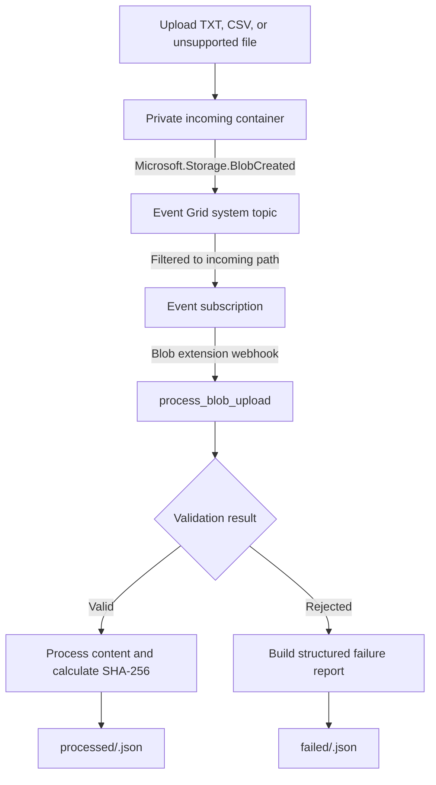
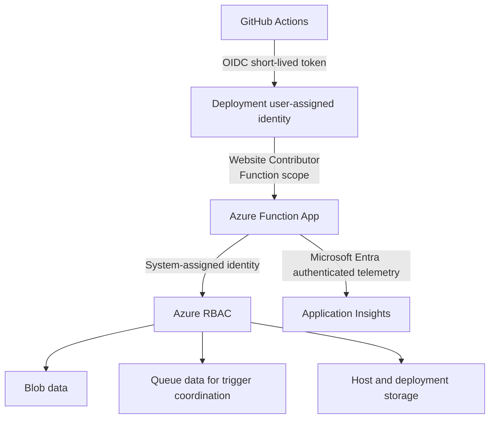
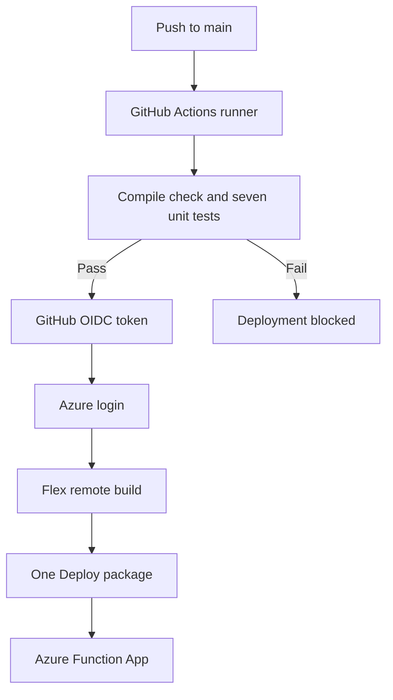
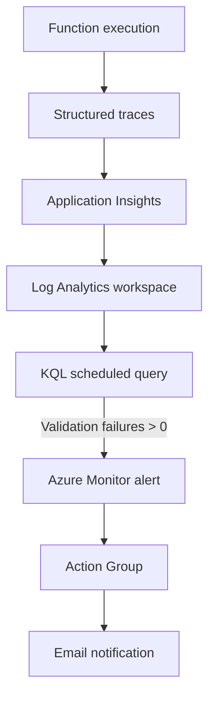

# Architecture

## Event-driven processing

The Event Grid subject filter begins with `/blobServices/default/containers/incoming/blobs/`. Output writes therefore do not trigger another execution.

## Identity and authorization

Runtime and deployment access remain passwordless after Storage Shared Key authorization is disabled.

## CI/CD pipeline

The federated credential is restricted to the repository and `main` branch and uses GitHub's immutable owner and repository identifiers.

## Monitoring and alerting

The tested alert detects structured validation rejection traces, transitions to `Fired`, and automatically resolves when the query window no longer contains matching events.

